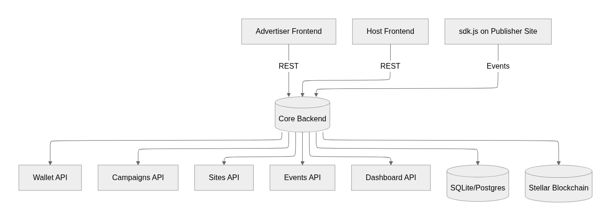
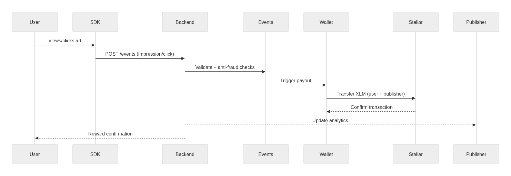

# Adescentralized – Core Application (Backend APIs)

**Decentralized Advertising Platform built on Stellar Blockchain**

This backend is the **management layer** of the Adescentralized ecosystem. It provides APIs and logic for advertisers and publishers to create campaigns, register sites, integrate the Stellar Ads SDK, and process payments with XLM. It also powers dashboards, anti-fraud logic, and reward distribution for end-users.

---

## 1) Introduction & Context

The backend enables:

* **Advertisers**: Campaign creation, targeting, budgets, metrics.
* **Publishers (Hosts)**: Site registration, revenue share config, SDK integration.
* **Users**: Earn XLM for verified ad views and clicks.

It integrates directly with **Stellar (Testnet/Mainnet)** to handle account creation, token transfers, and real-time payouts.

**Mission**: Provide a transparent, fraud-resistant, fair API backbone for decentralized advertising.

---

## 2) Architecture

### 2.1 Components

* **Wallet API**: Account creation, login, balance, transfers.
* **Campaigns API**: Manage advertisements.
* **Sites API**: Manage publisher sites.
* **Events API**: Track impressions/clicks, anti-fraud logic.
* **Dashboard API**: Aggregated stats.
* **Database**: SQLite (dev), PostgreSQL (prod).
* **Blockchain**: Stellar Horizon + Friendbot (testnet) / Mainnet.

### 2.2 Tech Stack

* Node.js 16+ / 18+
* Express.js
* SQLite (dev) → PostgreSQL (prod)
* Stellar SDK (JavaScript)
* Helmet, Morgan, Joi
* Jest + Supertest for testing

### 2.3 High-Level Architecture Diagram

<div align="center">



</div>

### 2.4 Sequence: Ad View to Payout

<div align="center">



</div>

---

## 3) Features

### Advertisers 🎯

* Create/manage ad campaigns.
* Define budget & CPC (in XLM).
* Track impressions/clicks & spend.
* Use tags for targeting.
* Automatic Stellar payments.

### Publishers 🌐

* Register websites for monetization.
* Generate SDK integration code.
* Configure revenue share (default 70%).
* Receive Stellar payouts automatically.
* Dashboard with revenue + metrics.

### End-Users 👤

* Earn **0.001 XLM** per verified impression.
* Earn a % of CPC value per click.
* Fraud protection (6h cooldown per site/user).

### Technical ⚡

* Authentication with Stellar wallets.
* RESTful API.
* Responsive web dashboard.
* Built-in SQLite (dev) / Postgres (prod).
* Anti-fraud system.
* Reward system integrated with Stellar.

---

## 4) API Reference

### Wallet

* `POST /wallet/` → Create account + wallet
* `POST /wallet/login` → Login
* `GET /wallet/:email` → Get balance
* `DELETE /wallet/:email` → Delete account

### Campaigns

* `POST /advertisements` → Create campaign
* `GET /advertisements/:userId` → List user campaigns
* `PUT /advertisements/:campaignId` → Update campaign
* `DELETE /advertisements/:campaignId` → Delete campaign

### Sites

* `POST /sites` → Register site
* `GET /sites/:userId` → List user sites
* `PUT /sites/:siteId` → Update site
* `GET /sites/:siteId/sdk-code` → Generate SDK code

### Dashboard

* `GET /dashboard/:userId` → Dashboard metrics

### Payments

* `POST /transfer` → Transfer XLM between accounts

### Events

* `POST /events/impression` → Register impression
* `POST /events/click` → Register click

**Sample (create campaign):**

```bash
curl -X POST http://localhost:3000/advertisements \
  -H "Content-Type: application/json" \
  -d '{
    "userId":"123",
    "title":"Ad Title",
    "description":"Buy now!",
    "imageUrl":"http://example.com/ad.png",
    "targetUrl":"http://example.com",
    "budget":100,
    "cpc":1,
    "tags":["tech","gaming"]
  }'
```

---

## 5) Database Schema

### Tables

* **users** → email, password (hashed), stellar\_address, role
* **campaigns** → advertiser\_id, budget, cpc, tags
* **sites** → publisher\_id, domain, revenue\_share
* **impressions** → site\_id, campaign\_id, user\_id, timestamp
* **clicks** → site\_id, campaign\_id, user\_id, timestamp
* **user\_rewards** → user\_id, amount, reason

---

## 6) Setup & Usage

### Prerequisites

* Node.js 16+ / 18+
* npm or yarn
* Stellar account (for admin)

### Install

```bash
npm install
```

### Development Server

```bash
npm run dev
```

### Access

* **Web**: [http://localhost:3000](http://localhost:3000)
* **Login**: [http://localhost:3000/login.html](http://localhost:3000/login.html)
* **Dashboard**: [http://localhost:3000/dashboard.html](http://localhost:3000/dashboard.html)
* **Health Check**: [http://localhost:3000/health-check](http://localhost:3000/health-check)

---

## 7) Production Config

### Environment Variables

```env
PORT=3000
DATABASE_PATH=/var/data/ads.sqlite
STELLAR_NETWORK=testnet # or mainnet
HORIZON_URL=https://horizon-testnet.stellar.org
```

## 8) Rewards System

* Impressions → 0.001 XLM/user.
* Clicks → % of CPC distributed.
* Publishers → 70% share of click revenue.
* Fraud Control → Cooldown 6h per user/site.

---

## 9) Integration with Stellar

* Each user receives a unique Stellar wallet.
* Accounts auto-funded in **Testnet** via Friendbot.
* All payments are processed and confirmed on-chain.
* In production: `mainnet` Horizon + explorer.

**Endpoints:**

* Horizon Testnet: `https://horizon-testnet.stellar.org`
* Explorer: `https://stellar.expert/explorer/testnet`
* Friendbot: `https://friendbot.stellar.org`

---

## 10) Observability & Monitoring

* Console + file logging (Winston).
* Metrics: impressions, clicks, CTR, spend.
* Alerts for fraud detection (suspicious patterns).
* Dashboards for advertiser and publisher roles.

---

## 11) Roadmap

* [ ] Manual campaign approvals
* [ ] Advanced reporting
* [ ] Stellar Mainnet rollout
* [ ] Admin dashboard
* [ ] Notifications system
* [ ] Automated backups
* [ ] PostgreSQL migration
* [ ] Advanced anti-fraud (ML-based)

---

## 12) Contribution Guidelines

* Follow Conventional Commits.
* Run `npm run lint` before committing.
* PRs must include tests + docs updates.
* Use feature branches.

---

## 13) License

MIT License (or Apache 2.0, update if needed)

---

## 14) Context Reminder

Adescentralized solves **high costs, opacity, and fraud** in digital advertising using Stellar for micro-payouts and Soroban contracts for transparency. This backend is the **management hub**: campaigns, sites, events, payments, rewards.

**Version**: Backend v2.0.0
**Last Updated**: September 2025
